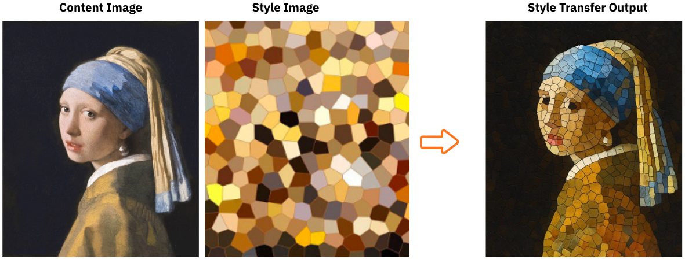

# 🎨 Style Transfer Without Neural Networks

Performs **image style transfer** using **classical image processing** — no deep learning required.  
It works by matching and replacing small image patches between a **content image** and a **style image**, transferring texture and tone statistics from one to the other.

## Concept Overview

Traditional neural style transfer (like Gatys et al., 2015) uses CNN feature maps to blend *content* and *style*.  
This method achieves a similar effect **purely through patch-based texture matching**.

### Key Idea
- An image’s **content** = its spatial structure (shapes, edges, object layout)  
- An image’s **style** = its local texture statistics (tone, contrast, roughness)  

By replacing each small patch in the content image with a visually similar patch from the style image, we transfer the style while roughly preserving the content layout.

## Intuition behind the logic

- Local mean and standard deviation capture basic **texture statistics**, which are essential for visual style (Julesz, 1962).  
- By matching these statistics, the algorithm recreates the **visual feel** of the style image.  
- The method is inspired by **non-parametric texture synthesis** (Efros & Leung, 1999) and **statistical texture models** (Portilla & Simoncelli, 2000).
